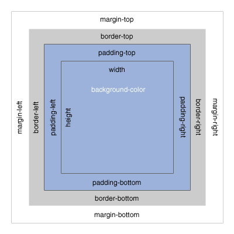
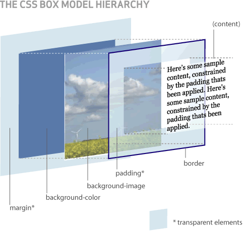

# CSS3

CSS3 es un lenguaje formal que se usa para definir la presentación de un documento HTML (o XML).

Un documento CSS3 es texto.

---

# Documento CSS3

```css
p {
  background-color: #ff0;
  color: #000;
  font-weight: bold;
}

.centrado {
  width: calc(97%-3px);
  margin: 0 auto;
}

#contenedor {
  border-radius: 5px;
}
```

---

# Ventajas de utilizar CSS

* Control centralizado de la presentación de un sitio web completo
* Simplificación del mantenimiento del sitio
* Posibilidad de especificar una hoja de estilos local para mejorar la accesibilidad. (ej: problemas de visión)
* Posibilidad de adaptar el layout y el diseño al dispositivo que está mostrando el sitio (*responsive*)
* Simplificar el código HTML5: menor tamaño (bytes), más claro, enfocado en el contenido y no en la presentación
* Simplificar la implementación del diseño (redondeados, sombras, gradientes…)

---

# Orden de cascada

1. Hoja de estilos del navegador (por defecto, los estilos dependen del navegador)
1. Hoja de estilos externa (declarada antes del tag `<style>`)
1. Estilos definidos en el `<head>` del documento HTML5 (tag `<style>`)
1. Estilos definidos en un tag HTML5 (atributo `style`)

---

# Hoja de estilos externa

Archivo vinculado en el `<head>`

```html
<head>
  <link href="archivo.css" rel="stylesheet">
</head>
```

Forma más recomendable

---

# Definidos en el <head>

En el elemento `<style>` dentro del elemento `<head>`

```html
<head>
  <style>
    p { margin: 0.25em; padding: 0.5em; }
  </style>
</head>
```

 Recomendable para estilos específicos de una página en particular

 ---

 # Definidos en el tag HTML

En el atributo `style` del elemento HTML en cuestión

```html
<div style="background:#f00;color:#fff;">Texto blanco sobre fondo rojo</div>
```

Utilizar solo para casos puntuales que así lo requieran

 ---

# Comentarios en CSS

Se pueden utilizar comentarios con el fin de ordenar el código o porque más de una persona lo utilizará

```css
/* Esto es un comentario */
p {
  text-align: center;
  /* esto es otro comentario que ocupa
     más de un renglón */
  color: #000;
}
```

 ---

# Selectores CSS

* Selectores *de etiqueta*: se escribe el nombre de la etiqueta. Ej: `body`
* Selectores *de id*: se escribe un `#` seguido del nombre del ID. Ej: `#cont_gral`
* Selectores *de clase*: se escribe un `.` seguido del nombre de la clase. Ej: `.resaltado`
* Selector *universal*: se escribe `*` y aplica los estilos a **todos** los elementos de la página

---

# Selectores CSS

Los selectores se pueden agrupar separados por `,` para aplicar los mismos estilos a todos los elementos seleccionados (operador lógico *AND*)

```css
h1, h2, h3, h4, h5, h6 {
  color: #0f0;
}
```

---

# Selectores CSS

Los selectores descendientes se pueden utilizar cuando un elemento se encuentra entre las etiquetas de apertura y de cierre del otro elemento.

```css
p span { color: red; }
section span { color: blue; }
```

---

# Selectores CSS - Ejemplos

```css
p, a, .negrita, span { color: #f00; }
```

---

# Selectores CSS - Ejemplos

```css
p, a, .negrita, span { color: #f00; }
```

Los estilos se aplican a todos los `<p>` y a todos los `<a>`, y a todos los elementos con `class="negrita"`, y a todos los `<span>`

---

# Selectores CSS - Ejemplos

```css
p a.negrita span { color: #f00; }
```

---

# Selectores CSS - Ejemplos

```css
p a.negrita span { color: #f00; }
```

Los estilos se aplican a todos `<span>` que están dentro de un `<a class="negrita">`, que a su vez están dentro de un `<p>`

---

# Pseudo-clases CSS

* `:link`, selecciona vínculos que aún no han sido visitados
* `:visited`, selecciona vínculos que han sido visitados
* `:hover`, selecciona el vínculo sobre el que está posicionado el mouse
* `:active`, selecciona el vínculo sobre el que el usuario está "presionando"
* `:first-of-type`, selecciona el primer elemento de su tipo
* `:last-of-type`, selecciona el último elemento de su tipo
* `:nth-of-type(N)`, selecciona el N-ésimo elemento de su tipo
* `:checked`, selecciona las opciones marcadas en `radio`/`checkbox`

---

# Pseudo-elementos CSS3

* `::before`, elemento virtual antes de la selección
* `::after`, elemento virtual después de la selección
* `::first-line`, primera línea de texto del elemento
* `::first-letter`, primera letra de la primera línea del texto del elemento

---

# Herencia

* Cuando se establece el valor de alguna propiedad en un elemento, todos sus descendientes heredan inicialmente ese mismo valor.

* La herencia de estilos no funciona en todas las propiedades CSS, por lo que se debe estudiar cada propiedad de forma individual.

---

# Box Model

 

El `margin` es el espacio desde el borde hacia afuera de la caja. El `border` es el borde de la caja. El `padding` es el espacio desde el borde hacia adentro de la caja

---

# Posicionamiento

* Estático (normal) `position:static`
* Relativo (desplazamiento con respecto a `static`) `position:relative`
* Absoluto (desplazamiento con respecto al contenedor) `position:absolute`
* Fijo (posición “fija” inamovible) `position:fixed`
* Flotante (“empuja” a izquierda o derecha) `float:left|right`

---

# Posicionamiento - Desplazamientos

Cuando se posiciona una caja (`position` no es `static`) es necesario especificar su desplazamiento respecto a la posición original:

```css
top: DESPLAZAMIENTO;
bottom: DESPLAZAMIENTO;
right: DESPLAZAMIENTO;
left: DESPLAZAMIENTO;
```

En el posicionamiento `relative`, el desplazamiento se hace desde la posición original del borde (superior / derecho / inferior / izquierdo) del elemento seleccionado.

En el posicionamiento `absolute`, el desplazamiento se hace respecto del borde (superior / derecho / inferior / izquierdo) del primer elemento padre diferente a `static`.

---

# Propiedad overflow

Controla la forma en que se muestra contenido que sobresale de un contenedor con altura fija:

* `visible`: el contenido no se corta y se muestra sobresaliendo (ajuste predeterminado)
* `hidden`: el contenido sobrante se oculta
* `scroll`: se muestra el contenido dentro del contenedor, pero con barras de scroll para navegarlo (aunque no sean necesarias)
* `auto`: según el navegador y la necesidad de mostrar contenido, con barras de scroll

---

# Propiedad z-index

Se usa para crear capas o niveles, ordenados según un eje Z. Solo tiene efecto en elementos posicionados, por ende tiene que ir acompañada de la propiedad `position`, ej:

```css
/* no modifica la posición del elemento con respecto a static,
   y lo "sube" al nivel 10 */
position: relative;
z-index: 10;
```

El `<body>` tiene z-index 0, los z-index negativos quedan "por detrás" del `<body>`

---

# Bordes redondeados

Hay varias formas de especificar los bordes redondeados:

```css
border-radius: RADIO-TL RADIO-TR RADIO-BR RADIO-BL;
```
```css
border-radius: MISMO-RADIO-PARA-TODOS-LOS-BORDES;
```
```css
border-radius: RADIO1/RADIO2; /* Elipse */
```

Ej: convertir una caja en un círculo
```css
.circulo {
  width: 100px;
  height: 100px;
  border-radius: 50%;
}
```

---

# Sombreado

```css
box-shadow: OFFSET-H OFFSET-V RADIO-BLUR RADIO-SPREAD COLOR;
```

Ejemplos:
```css
div.sombra {
  box-shadow: 5px 5px 8px #333;
}
```

```css
div.sombra_adentro {
  box-shadow: inset 2em 1em gold;
}
```

---

# Gradientes

* Gradiente lineal: `linear-gradient()`
https://developer.mozilla.org/en-US/docs/Web/CSS/linear-gradient

* Gradiente circular: `radial-gradient()`
https://developer.mozilla.org/en-US/docs/Web/CSS/radial-gradient

---

# Links

* MDN CSS (https://developer.mozilla.org/en-US/docs/Web/CSS)
* CSS Tricks (https://css-tricks.com/)
* Can I Use …? (https://www.caniuse.com/)
* CSS Zen Garden (https://csszengarden.com/)
* W3 Schools (https://www.w3schools.com/css)
