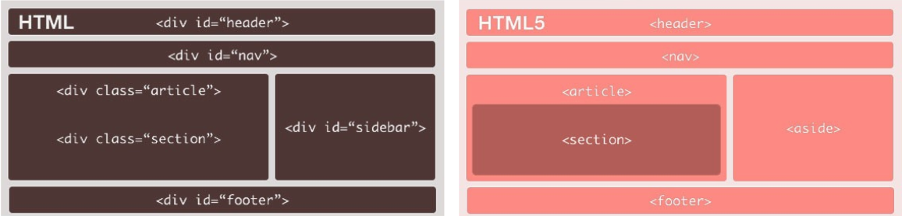

# HTML5

HTML5 es un lenguaje de marcas (*markup*), o etiquetas (*tags*), para la creación de documentos de hipertexto. Las etiquetas definen la estructura lógica del documento y la semántica del contenido.

Un documento HTML5 es texto: etiquetas y contenido.

---

# Documento HTML5

```html
<!DOCTYPE html>
<html>
  <head>
     <!-- Info sobre la página (título, hojas de estilo, codificación, metadatos, …) -->
     <meta charset="utf-8">
     <title>Título del documento</title>
  </head>
  <body>
     <!-- Contenido del documento (texto, imágenes, listas, tablas, formularios, …) -->
  </body>
</html>
```

---

# Tags HTML5

|Tags|Tipo de contenido|
|----|-----------------|
|```<h1>```, ..., ```<h6>```| Encabezados y títulos|
|```<p>```|Párrafos|
|```<em>```, ```<strong>```|Énfasis, importante|
|```<ol>```, ```<ul>```, ```<li>```|Listas con y sin orden|
|```<table>```, ```<thead>```, ```<tbody>```, ```<tr>```, ```<th>```, ```<td>```|Tablas|
|```<form>```, ```<input>```, ```<select>```, ```<textarea>```|Formularios|
|``````, ```<audio>```, ```<video>```|Imágenes, sonido y vídeo|

---

# Tags HTML5 - Continuación

|Tags|Tipo de contenido|
|----|-----------------|
|```<a>```|Anclas, vínculos|
|```<header>```, ```<footer>```, ```<nav>```, ```<section>```, ```<article>```, ```<aside>```|Estructura del documento|
|```<div>```, ```<span>```|Contenedores generales de caja y línea|
|```<br>```|Salto de línea (punto y aparte)|
|```<script>```, ```<object>```| Scripts y objetos (ej: Flash)|

---

# Listas sin orden

```html
<ul>
  <li>elemento</li>
  <li>otro elemento</li>
  <li>y otro elemento más</li>
</ul>
```

Ej: ingredientes para hacer una torta (no importa el orden, siempre voy a obtener una torta)

---

# Listas con orden

```html
<ol>
  <li>primer elemento</li>
  <li>segundo elemento</li>
  <li>tercer elemento</li>
</ol>
```

Ej: pasos para hacer una torta (si no sigo los pasos en orden, no voy a obtener una torta)

Puedo usar el atributo `start` para comenzar la numeración en un número distinto a 1. Por ejemplo:
```html
<ol start="5">
```

---

# Tablas (básicas)

```html
<table>
  <thead>
    <tr>
      <th>Encabezado 1</th>
      <th>Encabezado 2</th>
    </tr>
  </thead>
  <tbody>
    <tr>
      <td>Celda 1</td>
      <td>Celda 2</td>
    </tr>
    <tr>
      <td>Celda 3</td>
      <td>Celda 4</td>
    </tr>
  </tbody>
</table>
```

---

# Fusión de celdas (<th> o <td>)

```html
<td colspan="cant_columnas" rowspan="cant_filas">
```

Por ejemplo:
```html
<td colspan="3">
```
para que la celda ocupe 3 columnas (se fusione con las dos columnas siguientes)

---

# Formularios

```html
<form>
  <label for="user">Usuario:</label>
  <input type="text" id="user" name="user">
  <label for="pass">Contraseña:</label>
  <input type="password" id="pass" name="pass">
</form>
```

Se usan para que el usuario ingrese datos, que después serán procesados por el servidor

---

# Formularios - Radiobuttons

```html
<form>
  <label>Género:</label>
  <input type="radio" id="sexo-f" name="sexo" value="F">
  <label for="sexo-f">Femenino</label>
  <input type="radio" id="sexo-m" name="sexo" value="M">
  <label for="sexo-m">Masculino</label>
</form>
```

Se utilizan para opciones mutuamente excluyentes (una y solo una)

---

# Formularios - Checkboxes

```html
<form>
  <label>Te gusta:</label>
  <input type="checkbox" id="l-read" name="like-read" value="read">
  <label for="l-read">Leer libros</label>
  <input type="checkbox" id="l-biking" name="like-biking" value="biking">
  <label for="l-biking">Andar en bici</label>
  <input type="checkbox" id="l-movies" name="like-movies" value="movies">
  <label for="l-movies">Mirar películas</label>
</form>
```

Se utilizan para opciones múltiples (una o más)

---

# Formularios - Input File

```html
<form enctype="multipart/form-data">
  <label>Su foto:</label>
  <input type="file" name="photo" accept="image/jpeg">
</form>
```

Una API del lado del servidor es la que se ocupa de almacenar el archivo subido donde corresponda

---

# Formularios - Listas de selección

```html
<label for="country">Próximas vacaciones en:</label>
<select id="country" name="country">
  <option value="ar">Argentina</option>
  <option value="br">Brasil</option>
  <option value="uy">Uruguay</option>
  <option value="cl">Chile</option>
  <option value="eur">Europa</option>
  <option value="other">Otros destinos</option>
</select>
```

Se utiliza cuando hay más de 3 o 4 opciones disponibles

Se puede usar el atributo `multiple` para permitir elegir más de una opción (puedo usar el atributo `size` para determinar cuántos `<option>` muestra a la vez)

---

# Formularios - Input - Atributos

* `placeholder="texto predeterminado"` (Texto predeterminado a mostrar, ej: Ingrese su nombre)
* `autofocus` (Pone el foco en este elemento)
* `required` (Se debe completar, obligatorio)
* `pattern="expresión regular"` (El valor ingresado debe coincidir con la expresión regular)

---

# Imágenes

```html

```

Los tipos más comunes de imágenes soportadas son: GIF, JPEG, PNG, SVG

---

# Vídeos

```html
<video src="URL" controls autoplay></video>
```
Otros atributos opcionales: `width`, `height`, `preload=none|auto|metadata` (no tiene efecto si está presente el atributo `autoplay`)

Los formatos soportados son: MP4, WebM, Ogg

---

# Vídeos - Source

```html
<video controls>
  <source src="movie.mp4" type="video/mp4">
  <source src="movie.ogg" type="video/ogg">
  Su navegador no soporta elementos de video
</video>
```

El navegador busca secuencialmente la fuente soportada para poder reproducir el video

---

# Audio

```html
<audio src="URL" controls autoplay></audio>
```
Otros atributos opcionales: `preload=none|auto|metadata` (no tiene efecto si está presente el atributo `autoplay`)

Los formatos soportados son: WAV, MP3, Ogg

También soporta el `<source>` para especificar fuentes alternativas, como el tag `<video>`

---

# Links y anclas (anchors)

Links:
```html
<a href="URL">texto</a>
```

Anclas:
```html
<a id="nombre"></a>
```

URL especial para ejecutar algo (botón):

```html
<a href="javascript:sendData();">Enviar</a>
```

---

# HTML5 - Estructura



---

# Para más información

* W3C (https://www.w3.org/html/)
* MDN HTML (https://developer.mozilla.org/es/docs/Web/HTML)
* Can I Use …? (http://www.caniuse.com)
