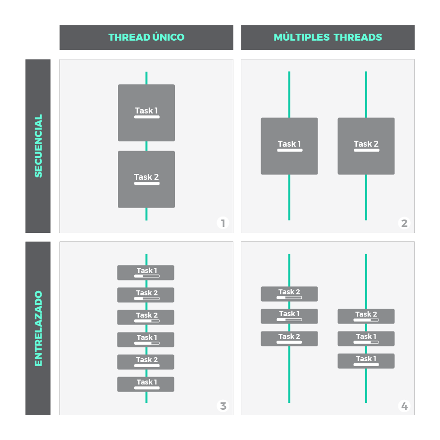
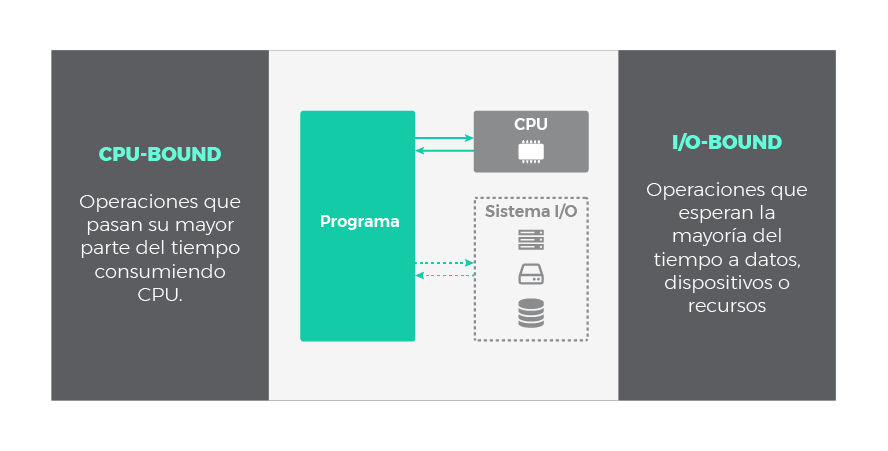
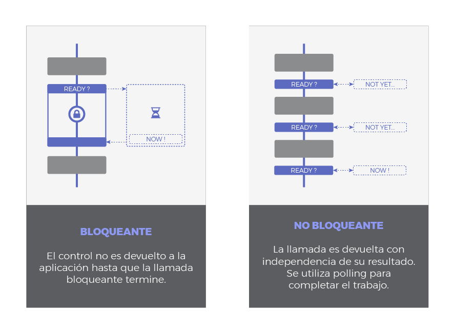
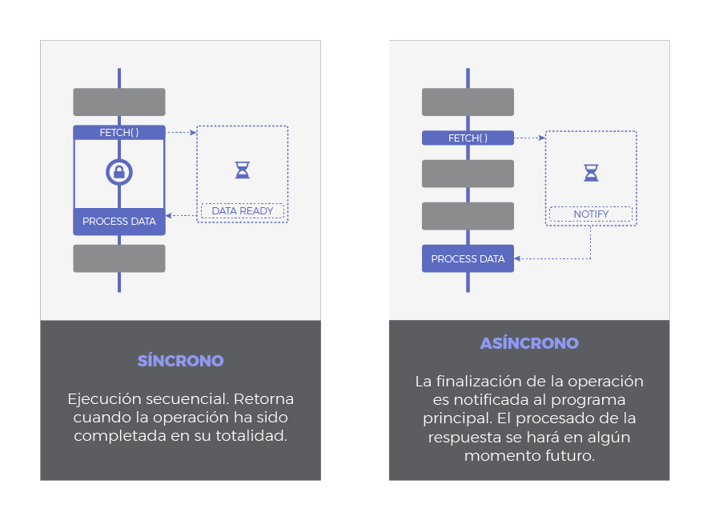

# Javascript asincrónico

Fuente: https://lemoncode.net/lemoncode-blog/2018/1/29/javascript-asincrono

---

# Concurrencia y paralelismo

* Concurrencia es cuando dos o más tareas progresan en simultáneo.
* Paralelismo es cuando dos o más tareas se ejecutan en el mismo instante de tiempo.
* El hecho que varias tareas progresen en simultáneo no implica paralelismo. Con un solo thread se puede programar de manera concurrente (caso de Javascript), pero no de manera paralela (son necesarios al menos dos threads para que haya paralelismo).

---



---

# CPU-bound vs. IO-bound

Las operaciones en sistemas se pueden dividir en dos grandes grupos:
* **CPU-bound**: son las operaciones típicas de cómputo (operaciones matemáticas complejas, render, etc.), donde la carga mayor recae en el procesador.
* **IO-bound**: son las operaciones típicas de entrada y salida (acceso a disco, transferencia de datos en la red, acceso a bases de datos, etc.), donde la carga mayor recae en los canales de comunicaciones.

La naturaleza de las operaciones *CPU-bound* es *sincrónica*, mientras que las de *IO-bound* es *asincrónica*.

---



---

# Bloqueante vs. No-bloqueante

* Una llamada bloqueante no devuelve el control hasta que no finalice. La ejecución de código no puede continuar hasta que termine dicha llamada.
* Una llamada no-bloqueante devuelve el control de inmediato. La ejecución de código puede continuar incluso si la llamada no terminó. En este caso debería haber algún mecanismo que permita ser informado cuando la llamada terminó para poder procesarla (por ejemplo *polling*: preguntar de manera periódica si ya terminó).

---



---

# Sincrónico vs. Asincrónico

* En las llamadas sincrónicas la ejecución es secuencial y no se puede ejecutar más código hasta que la llamada finalice.
* En las llamadas asincrónicas la ejecución se "dispara" y se puede seguir ejecutando código mientras la llamada se procesa (generalmente es un servicio "externo" el que procesa la llamada asincrónica); se puede recibir una notificación cuando la llamada asincrónica finaliza para poder procesar el resultado de la misma.

---



---

# Callbacks

* Un **callback es** simplemente **una función que se pasa como parámetro a otra función** para ser invocada en algún momento y completar una acción.
* Esenciales para el funcionamiento asincrónico. El resto de los patrones de asincronismo están basados en callbacks de una manera u otra.
* El callback se "programa" para ser ejecutado más adelante, por ejemplo: cuando se recibe la notificación que el proceso asincrónico finalizó, o cuando se produce el evento al cual se "asoció" el callback (`onclick`, `onkeyup`, ...).

---

# Callbacks - Ejemplos

Con funciones anónimas:
```js
setTimeout(function() {
  console.info("Pasó aprox. 1 segundo desde que me programaron para ser ejecutada...")
}, 1000)
```

Con funciones nombradas:
```js
function miCallback() {
  console.info("Pasó aprox. 1 segundo desde que me programaron para ser ejecutada...")
}
setTimeout(miCallback, 1000)
```

`setTimeout` retrasa la ejecución del callback como mínimo la cantidad de milisegundos especificados como segundo parámetro.

Probar:
```js
setTimeout(function() { console.info("Yo debería aparecer primero") }, 1000); console.info(" Sorpresa! Aparezco Yo")
```

---

# Promises

* Objeto que representa el resultado de una operación asincrónica. Si el resultado es exitoso se dice que la promesa está "resuelta". Si el resultado no es exitoso (por ej.: ocurre un fallo), se dice que la promesa está "rechazada".
* Sintaxis:
```js
unaPromesa.then(callbackResolve, callbackReject)
```
* Sintaxis preferida (más clara):
```js
unaPromesa.then(callbackResolve).catch(callbackReject)
```
* Se pueden encadenar ya que la llamada a `then()` también devuelve una promesa

---

# Promises - Ejemplo

Uso de la API fetch (para llamar a un *WebService*) https://developer.mozilla.org/es/docs/Web/API/Fetch_API

```js
fetch(unaURL).then(function(respuesta) {
  console.info("Respuesta: %o", respuesta)
}).catch(function(error) {
  console.error("!!! Error en la llamada a la API: %o", error)
}).then(function() {
  console.log("Finalizó la llamada a la API fetch")
})
```

---

# Composición de promesas

* Las promesas se pueden componer con `Promise.all(p1, p2, ..., pX)` y `Promise.race(p1, p2, ..., pX)`. Las promesas pasadas como parámetro se disparan a la vez y se ejecutan de manera asincrónica.
* `Promise.all()` devuelve, una vez que finalicen todas las promesas pasadas como parámetro, un array con los resultados de todas las promesas en el mismo orden en que fueron pasadas como parámetro.
* `Promise.race()` devuelve el resultado de la primer promesa que terminó de ejecutar, y el resto de las promesas se descarta.

---

# Creación de promesas

Se debe instanciar un objeto `Promise` pasando un callback con la "carga" (*payload*) de la promesa, es decir el código asincrónico que se desea ejecutar. Dicho callback tiene dos parámetros: `resolveCallback` (resolución) y `rejectCallback` (rechazo):
```js
function miPromesa(unaURL) {
  return new Promise(function(resolve, reject) {
    fetch(unaURL).then(function(datos) {
      resolve(datos)
    }).catch(function(error) {
      reject(error)
    })
  })
}

let url="https://..."
miPromesa(url).then(function(respuesta) {
  // proceso la respuesta
}).catch(function(err) {
  // proceso el error
})
```

---

# async / await (ES7)

* Cuando se encadenan muchos `.then()` las promesas se pueden volver poco legibles
* Hay veces que sería deseable escribir código asincrónico de manera similar al código sincrónico (sin callbacks)
* ECMAScript 7 (ES7) introdujo las palabras clave `async` y `await` para simplificar las promesas y la escritura del código asincrónico

---

# async / await - Ejemplo

```js
async function verificarServidor(url) {
  let response = await fetch(url);
  return response.status === 200 ? "OK" : "KO";
}

let urlDelServidor = "https://...";
verificarServidor(urlDelServidor).then(function(respuesta) {
  if ("OK" === respuesta) {
    console.info("El servidor en %s está disponible", urlDelServidor)
  } else {
    console.error("El servidor en %s no está disponible", urlDelServidor)
  }
})
```
