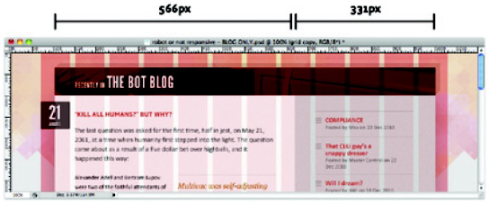

# Introducción al diseño web "Responsive"

* La web no es un lienzo, ni una página impresa
* La web se consume en una pantalla de tamaño fijo
* Cada vez hay más dispositivos diferentes (*tablet*, *smartphone*, *smartTV*, *smartwatch*, *autos*, *heladeras*...) para consumir contenido en la web
* Las pantallas son a la vez más chicas y más grandes
* El ancho de banda de las conexiones de Internet es cada vez mayor; sin embargo no siempre está disponible, o es costoso

---

# Diseño web "Responsive"

* Es la implementación única de un sitio para todos los tamaños (y orientaciones) de los dispositivos
* El sitio se adapta al tamaño del dispositivo
* La experiencia del usuario se ajusta según el dispositivo (potencia o características del hardware) y la conexión de red (calidad y velocidad)

---

# Ingredientes para el diseño web Responsive

* Layout flexible basado en grillas, tipografías flexibles, contenido multimedia flexible
* Adaptación al medio (“CSS Media Queries”)
* Degradación con gracia (*graceful degradation*)
* Mejora progresiva (*progressive enhancement*)

---

# Grilla web

 

---

# Grilla web - CSS

```css
#page {
  margin: 36px auto;
  width: 960px;
}

.blog {
  margin: 0 auto 53px;
  width: 900px;
}

.blog .main {
  float: left;
  width: 566px;
}

.blog .other {
  float: right;
  width: 331px;
}
```

---

# Grilla web - CSS flexible

```css
#page {
  margin: 2.25em auto;
  width: 90%;
  max-width: 960px;
}

.blog {
  margin: 0 auto 3.3125em;
  width: 93.75%; /* 900px/960px */
}

.blog .main {
  float: left;
  width: 62.88888889%; /* 566px/900px */
}

.blog .other {
  float: right;
  width: 36.77777778%; /* 331px/900px */
}
```

---

# Grillas flexibles

* Evitar usar `px` como unidad de tamaño donde sea posible
* Usar `max-width` (en un media query) para restringir el tamaño máximo
* Usar `%` para las cajas. Ej: en vez de `width:960px;`, usar `width:93.75%;` (suponiendo un contenedor de `1024px`)
* **resultado = objetivo / contexto**

---

# Tipografías flexibles

* Usar `body { font-size: 100%; }` para asegurar un tamaño base, por lo general `16px`
* Usar `em` para el resto de las tipografías. Ej: en vez de `font-size: 24px;` usar `font-size: 1.5em;`
* Usando la función `clamp()` se puede hacer que el texto se ajuste automáticamente dentro de un rango:
```css
html {
  font-size: clamp(1em, 0.75em + 1.5vw, 2em);
}
```
* **resultado = objetivo / contexto**

---

# Flexibilidad - Contexto

* Para **tipografías flexibles**, el *contexto* es **el tamaño del body**
* Para **márgenes flexibles**, el *contexto* es el **ancho del elemento contenedor**
* Para **padding flexible**, el *contexto* es el **tamaño del elemento mismo**

---

# Imágenes flexibles

* Restringir el tamaño máximo que pueden tener las imágenes (u otros medios)
```css
img { max-inline-size: 100%; block-size: auto; }
```
* También se pueden servir diferentes imágenes para los diferentes dispositivos
```html

```
* Para los iconos usar SVG en vez de PNG
---

# Fondos flexibles


```css
.blog {
  background: linear-gradient(90deg, #f8f5f2 63.11111111%, rgba(178,178,178,1) 63.11111111%);
}
```
Usar CSS3 `background-size` (`auto`, `ancho_y_alto`, `%`, `cover`, `contain`, `initial`, `inherit`) para ajustar al tamaño de la caja si es necesario

---

# Adaptarse al medio

* Cuando el tamaño del dispositivo disminuye o aumenta, el diseño flexible se adapta mejor que el diseño fijo...
* ... pero no sin problemas

---

# CSS Media Types

* Definir tipos de medios donde se consume el contenido web, para especificar CSS distintos para cada tipo
* `all`, `screen`, `print`, `speech`
```html
<link rel="stylesheet" media="print" href="impresora.css">
```
```css
@media print {
  /* reglas CSS para imprimir el sitio */
}
```

---

# CSS Media Queries

* Los “media type” solos no son suficientes debido a las diferencias (ej: diferente resolución) entre dispositivos del mismo tipo
* Los *media queries* brindan un mecanismo que permite aplicar un conjunto de reglas CSS de acuerdo a las características del dispositivo, como el tamaño, la resolución, o la orientación
* La sintaxis es la siguiente:
```css
@media MEDIO and (CONDICIÓN_1 and CONDICIÓN_2 ... and CONDICIÓN_N) {
  /* Reglas CSS para MEDIO que cumple con las condiciones 1, 2 ... N */
}
```

---

# Media Queries - Parámetros

| Característica |Definición | max- y min- |
|----------------|-----------|-------------|
| width | Ancho de la superficie de render | sí |
| height | Alto de la superficie de render | sí |
| orientation | Rotación, `portrait` o `landscape` | no |
| aspect-ratio | Rel. entre ancho y alto de la superficie de render | sí |
| resolution | Densidad de pixels del dispositivo | sí |

---

# Media Queries - Parámetros (cont)

| Característica |Definición | max- y min- |
|----------------|-----------|-------------|
| color | Bits de componente de color | sí |
| color-index | Cant. de entradas en tabla de colores | sí |
| monochrome | Bits por pixel en pantallas monocromáticas | sí |
| scan | Para TVs, `progresive` o `scan` | no |
| grid | Dispositivo basado en grillas | no |

---

# Ejemplos de Media Queries

```css
@media screen and (max-width: 480px) {
  /* Reglas CSS para pantallas chicas */
}
```

```css
@media screen and (max-width: 480px and orientation: portrait) {
  /* Reglas CSS para pantallas chicas en vertical */
}
```

```css
@media print and (min-resolution: 600dpi) {
  /* Reglas CSS para imprimir en alta resolución */
}
```

---

# Viewport

* El ancho reportado por el dispositivo puede diferir del ancho interno usado para hacer el render
```html
<meta name="viewport" content="initial-scale=1.0,width=device-width">
```

* `initial-scale=1.0` es el zoom al 100%
* `width=device-width` hace que el viewport del navegador sea igual al ancho del dispositivo

---

# Degradación “con gracia”

* Cada vez los dispositivos, y las redes que los vinculan, son más capaces y potentes
* Pensar, diseñar, y desarrollar primero para los dispositivos más capaces...
* ... asegurando y proporcionando “fallbacks” adecuados para los dispositivos menos capaces

---

# Mejora progresiva

* La web y el hardware están fluctuando constantemente y evolucionan a velocidad sorprendente. La tecnología de punta de hoy, es la obsoleta de mañana
* Pensar diseñar, y desarrollar primero para los dispositivos y las redes menos capaces...
* ... ampliando y mejorando la experiencia para los dispositivos y las redes más capaces

---

# Algunos links de interés

* [Wikipedia RWD](https://en.wikipedia.org/wiki/Responsive_web_design)
* [Wikipedia PE](https://en.wikipedia.org/wiki/Progressive_enhancement)
* [W3C Graceful degradation vs. progressive enhancement](https://www.w3.org/wiki/Graceful_degradation_versus_progressive_enhancement)
* [Multi-Device Layout Patterns](https://www.lukew.com/ff/entry.asp?1514)
* [Golden Grid System](https://goldengridsystem.com/)
* [A List Appart - Fluid Grids](https://alistapart.com/article/fluidgrids)
* [Google Developers - Mobile Sites](https://developers.google.com/webmasters/mobile-sites)
* [Learn Responsive Design](https://web.dev/learn/design/)
